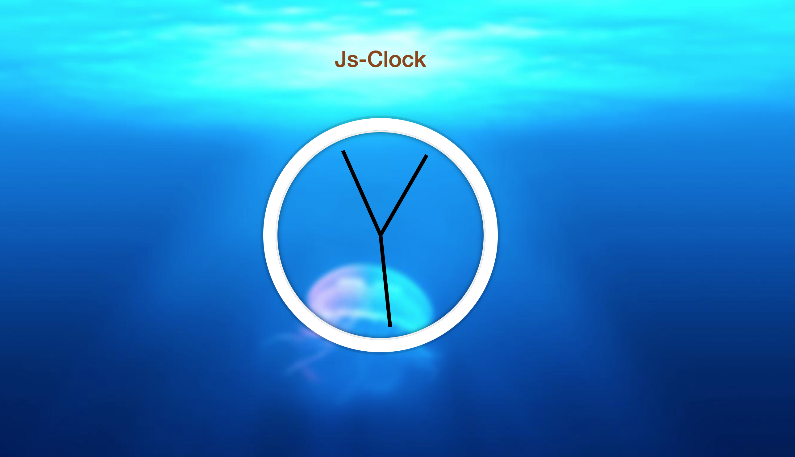

# #30 Days of Javascript Project

> - In this project, i created a clock, made with HTML semantic CSS, and Vanilla JS

# Author

> Oscar Andres Montes

> [E-mail](oscarandresmontes@gmail.com)

> [Github](https://github.com/andmontc)

> [Twiiter](https://twitter.com/dm_styx)

> [Linkedin](https://www.linkedin.com/in/andmontc/)